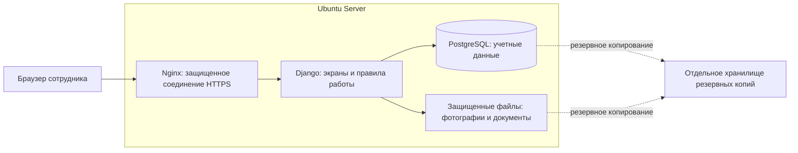

# Предложение по разработке системы управления ТОиР

Последующее решение пользователя по оформлению: палитра № 1 (#006cb5, #1c1e20, #ffffff), айдентика № 2 «Модуль» с монограммой «РЦ». Использовать комплект `../static/branding/`. Реализация функциональности согласуется поэтапно, с возможностью корректировать каждый бизнес-процесс.

Дата: 3 сентября 2026 года. Статус: предложение для обсуждения, не утвержденное ТЗ и не обязательство по срокам.

Основание: предоставленное ТЗ на 26 страницах и уточнение заказчика о первой версии без внешних интеграций, отчетности и мобильного приложения. PostgreSQL и Ubuntu Server заданы заказчиком. Положения исходного документа рассматриваются как требования к прежнему проекту; они не заменяют текущие ограничения MVP.

MarkItDown отсутствует в доступных Python-окружениях; установка завершилась ошибкой `No matching distribution found for markitdown[pdf]`. Текст извлечен локально через pypdf в `requirements-source.md`. Страницы 1 и 26 представляют собой изображения: прочитаны визуально и дополнены в Markdown. Функциональные требования на страницах 9–15 и таблица этапов на странице 19 дополнительно проверены по изображениям страниц. Markdown сохраняет постраничную структуру, но не воспроизводит оформление оригинала.

## Рекомендация

Разрабатывать собственное веб-приложение на Python/Django с PostgreSQL. Для первой версии использовать страницы Django, HTML/CSS и небольшие интерактивные элементы на HTMX/JavaScript. Развернуть на Ubuntu Server. Строить приложение из самостоятельных предметных модулей внутри одного проекта — такой подход называется модульным монолитом.

Это позволит создать удобные рабочие места мастера, планировщика и механика, последовательно расширяя функциональность. Собственная разработка требует постоянного владельца продукта, поддержки и обновлений. Наличие бесплатных базовых технологий не делает внедрение и эксплуатацию бесплатными.

## Что показывает исходное ТЗ

В разделе 3 указаны около 100 специалистов и более 200 работ в месяц. Эти данные описывают масштаб организации на момент составления ТЗ; число одновременно работающих пользователей, единиц техники, площадок и объем вложений не указаны. Признаков необходимости распределенной архитектуры из документа не следует; окончательное требование к мощности сервера определяется после уточнения нагрузки.

Раздел 4.12 содержит 15 блоков. Вместе они охватывают управление активами, ремонтами, ресурсами, стоимостью и надежностью. Это масштаб полноценной системы управления ТОиР с финансовыми и снабженческими функциями. Исключение интеграций, отчетности и мобильного приложения само по себе еще не делает оставшуюся часть небольшой.

Сильная сторона ТЗ — связность предметной области: оборудование и нормативы, планирование, наряды, фактические работы, эксплуатационные события, ресурсы и контроль. Разделы 5–8 также учитывают подготовку данных, обучение и опытную эксплуатацию. Эти работы нужны и собственной системе.

Для программирования требуется дополнение: точные поля, обязательность заполнения, статусы и права переходов, примеры ремонтных циклов, правила корректировки факта, критерии приемки. Например, формулировка «автоматизированное формирование графика» не определяет правила наложения ТО-250 и ТО-500 или действия при замене счетчика.

## Предлагаемый состав первой версии

Таблица ниже — предлагаемое сокращение функциональности. Оно требует закрепления в новом ТЗ; не все сокращения прямо названы в исходном запросе.

| Блок исходного ТЗ | В MVP | Последующее развитие |
|---|---|---|
| 4.12.1. Оборудование и нормативы, с. 9 | Карточки машин, модели, собственник, заказчик обслуживания, площадка, техническое место, статус эксплуатации, документы; основные узлы и история их установки | Протяженные объекты; полное управление оборотным фондом; бухгалтерские документы по активам |
| 4.12.2. НСИ, с. 9–10 | Типы и модели оборудования; справочники дефектов, отказов и простоев; виды ТО; ремонтные циклы; технологические карты и их версии; базовая критичность | Сложные маршруты обходов, развитое управление конфигурацией, отдельная система обработки НСИ |
| 4.12.3. Планирование, с. 10 | ТО по наработке и календарю; прогноз при наличии исходных данных; список и календарь работ; ручной перенос с причиной; заявки; аварийные заказы; плановые операции и ресурсы | Оптимизация общего графика, подробные сметы и сложное ресурсное планирование |
| 4.12.4. Оперативное планирование, с. 11 | Ручное назначение исполнителей и бригад на смену; минимальный справочник квалификаций и проверка назначений | Автоматическая оптимизация загрузки, полноценная матрица квалификаций и сложная диспетчерская доска |
| 4.12.5. Наряды и работы, с. 11 | Выполнение операций, частичное завершение, трудозатраты, материалы, комментарии и вложения; приемка и закрытие | Отчеты, финансовое проведение и бухгалтерское списание |
| 4.12.6. Подрядчики, с. 11 | При необходимости — указание внешнего исполнителя в заказе | Договорной учет подрядчиков, давальческие материалы, рекламации и расчеты |
| 4.12.7. Эксплуатация, с. 11–12 | Ручной ввод показаний, регистрация дефектов, отказов и интервалов простоя; история; результаты осмотра в карточке | Автоматическое получение телеметрии, настраиваемые формулы технического состояния |
| 4.12.8. Мобильное приложение, с. 12–13 | Не входит по решению заказчика | Приложение, работа без связи, синхронизация, QR/NFC |
| 4.12.9. Стоимость ремонтов, с. 13 | Первичные количества материалов и трудозатраты; структуры данных для последующего учета стоимости | Полный расчет стоимости, статьи затрат, тарифы и цены, капитализация |
| 4.12.10. МТО, с. 13 | Потребность и фактический расход по заказу; вручную указанный статус обеспеченности; принадлежность материалов компании или заказчику | Остатки, резервы, движения по складу, закупки и управление запасами |
| 4.12.11. Бюджетирование, с. 13 | Не предлагается включать | Финансовые планы, лимиты, согласование бюджета |
| 4.12.12. Надежность, с. 13–14 | Классификация отказов, причин, критичности и сохранение событий | RCA-анализ, матрицы рисков, программы повышения надежности |
| 4.12.13. KPI и отчетность, с. 14 | Не входит; доступны рабочие списки, поиск, фильтры и карточки | КТГ, КИО, аналитические панели, отчеты, выгрузки для аналитики |
| 4.12.14. Интеграция, с. 14–15 | Не входит по решению заказчика | 1С, ЗУП, складские системы, MES/SCADA и другие обмены |
| 4.12.15. Контрольные процедуры, с. 15 | Роли, ограничения по подразделениям/площадкам, журнал изменений, простой маршрут выпуска и приемки заказа, проверка исходных данных | Конструктор маршрутов согласования и сложные процедуры управления НСИ |

Первичную загрузку оборудования и нормативов из согласованного Excel/CSV-шаблона предлагается предусмотреть как разовый перенос исходных данных с предварительной проверкой. Это не постоянная интеграция; решение о таком способе начального наполнения следует закрепить отдельно. Универсальный конструктор преобразования любых таблиц не нужен.

Без связи со складом программа не знает реальных остатков автоматически. Если в MVP появится собственный складской учет, потребуются начальные остатки, поступления, выдачи, возвраты, резервы и инвентаризации. Это отдельное расширение объема. Рекомендуемый MVP фиксирует потребность, подтверждение обеспеченности и использование материалов в ремонте.

Отсутствие отчетов не должно приводить к потере первичных данных: время событий, фактические операции, материалы, исполнителей и причины следует собирать сразу. Тогда аналитику можно будет построить на накопленной истории.

## Три варианта реализации

| Критерий | Django + HTMX/JavaScript | Django API + React или Vue | Адаптация Odoo Maintenance |
|---|---|---|---|
| Принцип | Сервер формирует страницы; отдельные области обновляются без перезагрузки | Django хранит данные и исполняет правила; отдельное приложение формирует интерфейс | Используется готовая платформа, к ней добавляются настройки и модули |
| Старт | Наиболее прямой путь для собственного MVP с формами, журналами и карточками | Нужно сразу организовать взаимодействие двух частей приложения | Типовые карточки и заявки доступны быстрее, если процессы подходят |
| Преимущества | Единый проект, проще сопровождение, меньше дублирования; полный контроль над процессом | Удобная основа для сложных интерактивных рабочих мест; API можно использовать в будущем | Готовая база оборудования, команды, заявки и календарь обслуживания |
| Ограничения | Сложная диспетчерская доска потребует дополнительного JS и отдельного проектирования | Больше кода и проверок; сложнее выпуск обновлений; API само по себе не решает офлайн-работу | Ремонтные циклы по моточасам, агрегатная история и особенности сервисной организации нужно проверять на конкретной редакции и модулях |
| Затраты | Ожидаемо ниже среди двух вариантов собственной разработки при равном объеме MVP | Ожидаемо выше на старте при равной функциональности; величина зависит от команды | Могут быть ниже при хорошем совпадении типовой функциональности; доработки и обновления могут изменить результат |
| Зависимость | От качества документации и команды сопровождения | От команды серверной и клиентской разработки | От платформы, редакции и разработчиков дополнительных модулей |
| Вывод | Рекомендуется для первого этапа | Выбирать при подтвержденной необходимости сложного интерактивного интерфейса уже в MVP | Рассматривать после демонстрации ваших сквозных сценариев на реальных примерах |

Сравнение стоимости качественное, это инженерная оценка, а не коммерческая смета. Во всех вариантах остаются расходы на подготовку данных, внедрение, обучение и поддержку.

Django содержит механизмы пользователей, групп и разрешений. Ограничения по конкретным заказчикам, площадкам и подразделениям, а также полноценный бизнес-аудит нужно реализовать в нашем приложении. [Документация Django](https://docs.djangoproject.com/en/5.2/topics/auth/default/).

HTMX позволяет обновлять части страницы ответами сервера. Это подходит для фильтров, форм, смены статусов и действий в таблицах. [Документация HTMX](https://htmx.org/docs/).

Для отдельного интерфейса на React потребуется выбрать и поддерживать решения для переходов между экранами, получения данных и других функций приложения. [Документация React](https://react.dev/learn/build-a-react-app-from-scratch).

В Odoo документированы оборудование, команды, корректирующее и профилактическое обслуживание, заявки и календарь. Из этого не следует готовое покрытие всего рассматриваемого ТЗ. [Заявки на обслуживание](https://www.odoo.com/documentation/19.0/applications/inventory_and_mrp/maintenance/maintenance_requests.html), [настройка оборудования и команд](https://www.odoo.com/documentation/19.0/applications/inventory_and_mrp/maintenance/maintenance_setup.html). Самостоятельное размещение с PostgreSQL и Ubuntu описано в [инструкции по установке Odoo](https://www.odoo.com/documentation/19.0/administration/on_premise/source.html). Доступность функций и условия использования необходимо проверять для выбранной редакции и каждого дополнительного модуля.

## Как будет устроено рекомендованное решение

Пользователь открывает адрес системы в браузере и входит под своей учетной записью. Устанавливать программу на каждый компьютер не потребуется. Интерфейс и подсказки — на русском языке.

Основные части:

- Python/Django: правила работы, проверки данных, пользователи, формы и операции. Рабочие места мастера и планировщика проектируются отдельно; административная панель предназначена для администрирования.
- HTML/CSS, HTMX и JavaScript: внешний вид, поиск, фильтры, редактирование, календарь, обновление части экрана.
- PostgreSQL: связанные учетные данные и история. Записи о заказе, материалах и смене статуса должны сохраняться согласованно — либо вся операция, либо никакая ее часть.
- Файловое хранилище: документы и фотографии; в PostgreSQL хранятся их описания, связи и права доступа. Файлы выдаются после проверки доступа.
- Ubuntu Server, Nginx и Gunicorn: запуск веб-приложения и прием соединений. Автоматический перезапуск и периодические служебные задания можно организовать штатными средствами сервера.
- Отдельное хранение резервных копий: база, вложения и необходимая конфигурация восстановления. Копия только на том же сервере не защищает от его потери.

Для разработки разумен поддерживаемый Django 5.2 LTS с актуальными исправлениями безопасности; официальная расширенная поддержка серии указана до апреля 2028 года. Версии Python и PostgreSQL фиксируются после проверки совместимости на старте. [Сроки поддержки Django](https://www.djangoproject.com/download/).

Бизнес-правила следует отделить от экранных форм. Тогда позднее API для интеграций или мобильного клиента сможет использовать уже реализованные правила. Разработка API, синхронизации и мобильного интерфейса все равно останется самостоятельной работой.

Для пилота на одной площадке можно предварительно рассматривать сервер с 4 виртуальными процессорными ядрами, 8–16 ГБ оперативной памяти и SSD. Это отправная точка оценки, не подтвержденный сайзинг. Объем диска определяется прежде всего вложениями, сроком хранения и резервными копиями; производительность проверяется по согласованному числу одновременно работающих пользователей.

Микросервисы, отдельную аналитическую базу, Kubernetes и сложную очередь фоновых задач на этом этапе не предлагается вводить. Периодический перерасчет потребности в ТО можно выполнять по расписанию и после ввода наработки, с защитой от повторного создания заказов.

## Правила, которые нужно заложить до разработки

1. **Собственник, заказчик обслуживания и место работы машины.** Компания оказывает услуги сторонним предприятиям. Машина должна иметь самостоятельную идентичность, а площадка и техническое место — историю привязок. Перемещение не должно менять принадлежность старого ремонта к площадке, на которой он произошел. Вход внешних заказчиков в MVP не предполагается.
2. **Машина и сменный агрегат.** Основной номерной агрегат имеет свою карточку. Установка на другую машину фиксируется событием с датой и показаниями. Наработка машины и наработка агрегата не должны безусловно совпадать. Это позволяет начать с простой истории замен, а оборотный фонд развить позднее.
3. **Циклы ТО.** Правила задаются по модели техники и утвержденному регламенту. Нужны интервалы, исходная точка цикла, календарные ограничения, допустимые отклонения, правила включения меньших ТО в большие, порядок учета досрочного или просроченного выполнения. Одной формулы «последнее ТО + 250» для всей техники недостаточно.
4. **Наработка.** Хранить журнал показаний с датой, автором и источником. Уменьшение показания допускается только через оформленную корректировку или замену счетчика с сохранением накопленной наработки. При устаревших данных показывать дату последнего ввода; календарный прогноз не выдавать за точное обязательство.
5. **Дефект, отказ и заказ.** Дефект описывает проблему, отказ — событие потери работоспособности, заказ организует устранение. Один заказ может включать несколько проблем; частичное выполнение не закрывает все связанные дефекты автоматически. Причину отказа следует хранить у события отказа, а не единственным изменяемым полем машины, как можно понять из формулировки на с. 10.
6. **Простой и трудозатраты.** Хранить время остановки, интервалы ожидания и восстановления отдельно от человеко-часов. Несколько заказов одной остановленной машины не должны удваивать продолжительность простоя. Два механика по 3 часа дают 6 человеко-часов; простой может составлять 10 часов из-за ожидания материалов.
7. **Выполнение и приемка.** Состояния заказа, отдельных операций и доступности техники разделяются. Закрытие заказа допускается после обязательных данных и приемки; исправление закрытого заказа выполняется уполномоченным сотрудником с причиной и сохранением истории.
8. **Историческая достоверность.** В выпущенном заказе сохраняется использованная версия технологической карты. Обновление нормативов не переписывает завершенные ремонты. При будущем расчете стоимости также потребуются цены и ставки, действовавшие на нужную дату.
9. **Права и одновременная работа.** Права действуют на сервере для чтения, записи и вложений. Повторное нажатие не создает дублирующий заказ; одновременное изменение одной карточки не должно незаметно затирать чужие данные.

## Пример рабочего процесса

Пример иллюстративный; значения не являются нормативами для конкретной модели.

У ПДМ есть регламент с ближайшим ТО на отметке 4 250 моточасов. Введено показание 4 230. Система показывает «до ТО осталось 20 моточасов», а также дату показания. При расчетной работе 10 моточасов в сутки прогноз составляет около двух рабочих суток; дата зависит от фактической загрузки.

Планировщик создает заказ из утвержденной технологической карты, назначает смену и бригаду. Мастер подтверждает обеспеченность материалами. После выполнения фиксируются операции, фактические трудозатраты, использованные материалы, показание счетчика и результат. Уполномоченный мастер принимает работу. Следующая потребность рассчитывается по установленному правилу ремонтного цикла.

Если на отметке 4 500 регламент предусматривает ТО-500 с включением операций ТО-250, система формирует один согласованный комплект работ. Она не должна независимо создавать два заказа с повторяющимися операциями. Это правило применяется только там, где оно подтверждено регламентом.

При аварии мастер регистрирует остановку, отказ и срочный заказ, назначает исполнителя по упрощенному маршруту. После восстановления фиксируются причина, выполненные операции и время возвращения машины в работу. Требование предварительного обычного согласования не должно мешать регистрации уже начатой аварийной работы; конкретные полномочия закрепляются в регламенте.

Предлагаемая основная цепочка заказа: черновик → к выполнению → в работе → выполнен → принят/закрыт. Ожидание материалов, приостановка и отмена оформляются отдельными предусмотренными переходами с причиной. Допуск техники к эксплуатации — самостоятельное решение уполномоченного сотрудника.

## Что нужно пересмотреть в исходном документе

| Положение | Вывод для нового проекта |
|---|---|
| Реализация на базе ПО из реестра российских программ, п. 4.9, с. 7 | Сам выбор Django не подтверждает выполнение требования. Нужно определить, сохраняется ли оно, и как будет подтверждаться для выбранного решения. Это вопрос требований заказчика, не утверждение о применимости законодательства |
| Гарантия официального дистрибьютора, п. 4.8, с. 6; терминология 1С, с. 4 | Для собственной разработки нужны условия сопровождения, владения кодом, передачи документации и ответственности за исправления |
| Круглосуточность, работа при отказе компонентов, замена без остановки, восстановление до 8 часов, с. 5–6 | Один сервер — возможная схема пилота, но он не обеспечивает все эти условия. Требуется либо согласованное упрощение MVP, либо резервирование компонентов |
| Автономное питание на 8 часов, с. 6 | Инфраструктурное требование, которое не обеспечивается прикладным кодом. Должно быть подтверждено владельцем площадки размещения |
| Сохранность, п. 4.11.5, с. 8 | Помимо времени восстановления нужно определить допустимую потерю данных. Ежесуточная копия допускает потерю изменений после последнего успешного копирования; для меньшего интервала нужна другая схема |
| Минимальное привлечение сотрудников заказчика, п. 5.1, с. 15 | Для собственной системы необходим ответственный за процессы и доступность мастеров/планировщиков для проверки правил и пилота |
| СПОУД и сложная подготовка НСИ, с. 15–18 | Для MVP предлагаются проверяемые шаблоны и контролируемая загрузка. Отдельная универсальная платформа обработки справочников расширит проект |
| Срок этапа 3 «2 месяца с даты окончания этапа 3», таблица 3, с. 19 | В исходном графике самоссылка. Его нельзя непосредственно использовать для оценки нового проекта |
| Матрицы ролей и доступа отнесены к документам этапа интеграций, с. 25 | Для MVP права требуются с первого рабочего сценария независимо от интеграций |
| Испытания на продуктивной среде, с. 21–23 | Предварительную проверку изменений целесообразно выполнять на отдельном тестовом экземпляре; рабочий пилот проводить после нее |

Требования к защите информации и исключению конфиденциальных данных на с. 7 нужно соотнести с фактически разрешенным составом данных: сотрудниками, заказчиками, договорами и будущими ценами. Решение принимает владелец данных в рамках правил компании.

Публикация должна включать HTTPS, защищенные настройки приложения и базы, контроль доступа к файлам, журналы ошибок и проверку восстановления. Эти работы входят в готовность к эксплуатации. [Рекомендации Django по развертыванию](https://docs.djangoproject.com/en/5.2/howto/deployment/checklist/).

## Порядок реализации и проверка результата

| Этап | Результат |
|---|---|
| Уточнить процессы и исходные данные | Согласованный состав MVP, поля, роли и правила; несколько реальных примеров ТО и аварийного ремонта |
| Создать основу | Пользователи и права, заказчики/площадки, оборудование и узлы, нормативы, начальная загрузка |
| Реализовать сквозные сценарии | Наработка → потребность в ТО → заказ → выполнение → приемка; дефект/отказ → аварийный заказ → восстановление |
| Подготовить эксплуатацию | Рабочие формы, аудит, инструкции, резервное копирование, тестовый и рабочий экземпляры |
| Провести пилот на одной площадке | Мастера работают с реальными машинами и заказами; ошибки и неудобства исправлены до расширения |

Для описанного сокращенного объема предварительный ориентир — 12–20 календарных недель до завершения пилота при одном опытном разработчике на полной занятости, регулярном участии владельца процесса, доступном тестировщике и помощи системного администратора. Это моя оценка порядка работ, не срок из исходного ТЗ. Неготовые нормативы, сложные согласования, полноценный склад или расширенный учет агрегатов существенно меняют оценку. Денежная смета требует согласованного объема и состава команды.

Примеры ожидаемого результата при приемке:

| Проверяемый сценарий | Как выглядит правильный результат |
|---|---|
| Показание 4 230; порог ближайшего ТО 4 250 | Остаток 20 моточасов, видна дата исходного показания |
| Повторный запуск расчета ТО | Повторный заказ на то же плановое обслуживание не создается |
| ТО-500 включает ТО-250 по утвержденному регламенту | Повторяющиеся операции не назначены дважды |
| Счетчик заменен | История прежних показаний сохранена; общая наработка не обнулилась |
| Номерной агрегат перенесен на другую машину | Видны старая и новая установки, даты и самостоятельная история агрегата |
| Из двух дефектов устранен один | Второй остается открытым; статус машины не меняется без основания |
| Два механика работали по 3 часа; машина стояла 10 часов | Сохранены 6 человеко-часов и 10 часов простоя как разные величины |
| Мастер площадки А открывает закрытые ему данные площадки Б | Отказ в доступе, включая прямой адрес карточки и вложения |
| Технологическая карта обновлена после выполнения заказа | Выполненный заказ сохраняет прежнюю версию работ и нормативов |
| Восстановление из резервной копии | На тестовом экземпляре доступны и записи, и прикрепленные файлы; измеренное время укладывается в согласованное значение |

Для следующего шага необходимо определить правила циклов ТО на ваших моделях, глубину учета номерных агрегатов, роли при приемке и источник ввода наработки. На этой основе можно подготовить короткое функциональное ТЗ MVP, схему данных и макеты основных экранов.
